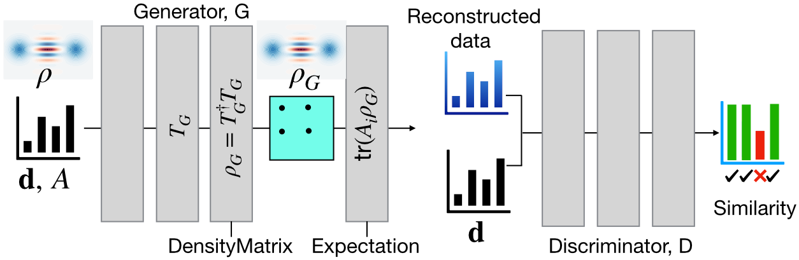

qst-cgan

Quantum state tomography with conditional generative adversarial networks
----------------------------------------------------------------------------

This repository contains the full code to reproduce [https://arxiv.org/abs/2008.03240](https://arxiv.org/abs/2008.03240) (accepted in PRL on June 10, 2021). Some parts of the figures in the paper are generated here with the implementation of the CGAN in TensorFlow. In addition, check out the implementation of accelerated-project-gradient based maximum likelihood estimation (APG-MLE) from [qMLE](https://github.com/qMLE/qMLE) [https://arxiv.org/abs/1609.07881](https://arxiv.org/abs/1609.07881) to have a fast MATLAB code that reconstructs density matrices from noisy data.

Fig 1: Illustration of the CGAN architecture for QST. Data $\mathbf d$ sampled from measurements of a set of measurement operators $A$ on a quantum state is fed into both the generator $G$ and the discriminator $D$. The other input to $D$ is the generated statistics from $G$. The next to last layer of $G$ outputs a physical density matrix and the last layer computes measurement statistics using this density matrix. The discriminator compares the measurement data and the generated data for each measurement operator and outputs a probability that they match.

Installation and use
--------------------

To run the code:

	- clone this directory

	- cd to the current folder `cd qst-cgan`

	- make a local installation with `pip install -e .` which installs the necessary libraries such as tensorflow-cpu and qutip to run the code.

	- cd to the folder paper-figures `cd paper-figures` and run the notebooks

Please note that the code works only with the CPU version of TensorFlow which
can be installed specifically with:

`pip install tensorflow-cpu`

Please send me an email if you face any trouble running the code at "shahnawaz.ahmed95@gmail.com".
