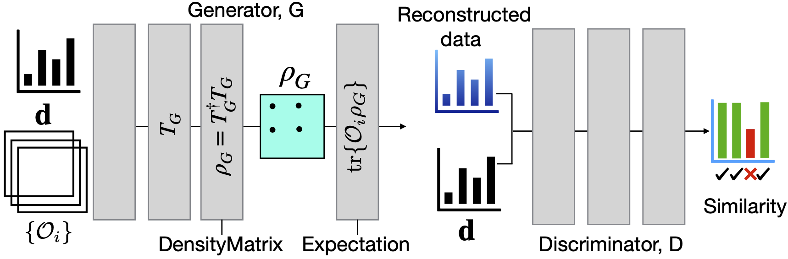

##  qst-cgan
# Quantum state tomography with conditional generative adversarial networks




Fig 1: Illustration of the CGAN architecture for QST. Data $\mathbf d$ sampled from measurements of a set of measurement operators $A$ on a quantum state is fed into both the generator $G$ and the discriminator $D$. The other input to $D$ is the generated statistics from $G$. The next to last layer of $G$ outputs a physical density matrix and the last layer computes measurement statistics using this density matrix. The discriminator compares the measurement data and the generated data for each measurement operator and outputs a probability that they match.

The full code to reproduce [https://arxiv.org/abs/2008.03240](https://arxiv.org/abs/2008.03240) will be available here soon.


### Installation and use

The code is not tested and may contain many bugs right now. However if you have the following packages installed in a Python 3 environment, you should be able to run the ```examples/qst-cgan.ipynb``` notebook:

	- qutip
	- tensorflow==2.0
	- tensorflow_addons=0.6
	- IPython

To run the code after manually installing the needed packages:
	- clone this directory
	- cd to the current folder `cd qst-cgan`
	- make a local installation with `python setup.py develop`
	- cd to the example folder `cd examples` and try to run `qst_cgan.ipynb`


Please send me an email if you face any trouble running the code at "shahnawaz.ahmed95@gmail.com". I will be rigorously testing the code and refactoring it soon.
